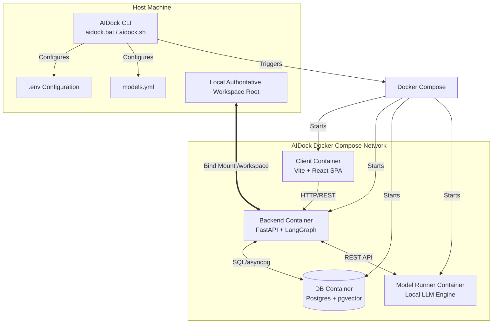
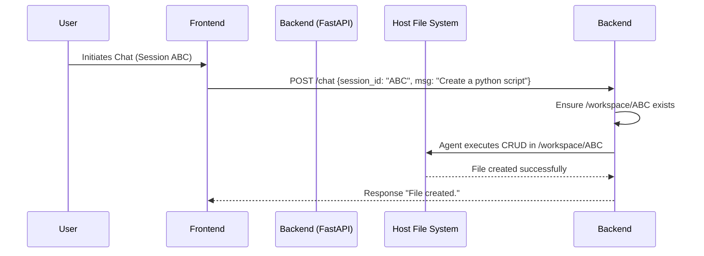

# AIDock Technical Architecture

AIDock provides an accessible, lightweight orchestration layer for running local AI agents with robust persistence and memory capabilities. This document details the technical implementation, data flows, and container topologies.

## High-Level System Topology

The architecture revolves around a dynamic, CLI-driven configuration phase followed by a strictly orchestrated Docker Compose runtime.

## Component Deep Dive

### 1. AIDock CLI (`cli/aidock.py`)
The Python-based CLI serves as the user entrypoint, completely abstracting the complexity of Docker setups. 
- **Environment Isolation:** Executed via `aidock.bat` or `aidock.sh`, it automatically provisions an isolated `.venv` to prevent dependency conflicts on the host system.
- **Dynamic Configuration:** It interactively prompts the user for their desired workspace root and selected Agentic Profile. It writes these selections directly to `.env` (`WORKSPACE_MOUNT_PATH`, `LLM_MODEL_NAME`).
- **On-Demand Footprint:** It orchestrates image pruning and ensures only the models explicitly requested by the selected profile are pulled and instantiated by the Model Runner.

### 2. File System & Dynamic Sub-Folder Routing
To prevent polluting the host filesystem while maintaining strict organization, the backend employs dynamic sub-folder routing.

- The user's chosen root path is **bind-mounted** to `/workspace` inside the `backend` container.
- When a new chat session begins, the backend identifies the `session_id` and automatically generates an isolated sub-folder (e.g., `/workspace/session_ABC`).
- The LangGraph agent is sandboxed; all CRUD tool executions are forcefully relative to this specific sub-folder, ensuring project files remain impeccably organized and isolated.

### 3. Persistent Semantic Memory (Postgres + pgvector)
AIDock is designed to act as a long-term assistant. It leverages a dedicated PostgreSQL 16 container equipped with the `pgvector` extension to guarantee memory retention across container restarts.

- **Checkpointer State:** The LangGraph agent's state (conversation history, tool call outputs) is serialized and stored in Postgres. If the user stops the stack and resumes later, the agent perfectly recalls the conversation context.
- **Semantic Vector Storage (RAG):** The backend mirrors the `AI_Codex` pattern, utilizing `pgvector.sqlalchemy`. The agent can index the contents of the `/workspace` and store the embeddings in Postgres, enabling powerful semantic search over local project files without sending code to external APIs.

### 4. Orchestration Lifecycle (`docker-compose.yml`)
The platform runs four primary containers connected via an internal Docker network:
- **`model-runner`**: Uses the local LLM engine provided by **Docker Model Runner** (Ollama API-compatible) utilizing the models directory volume.
  > [!IMPORTANT]
  > This requires Docker Desktop's **Docker Model Runner** feature to be enabled in Settings -> AI -> Enable Docker Model Runner. If not enabled, model image pulls and runs will fail.
- **`db`**: Retains agent memory via the `aidock_pgdata` named volume.
- **`backend`**: Connects to the DB and Model Runner. Crucially mounts the host workspace directory to allow agentic file modifications.
- **`client`**: Nginx serving the Vite/React SPA, routing `/api/*` requests to the backend, and exposing its web port to the host.
