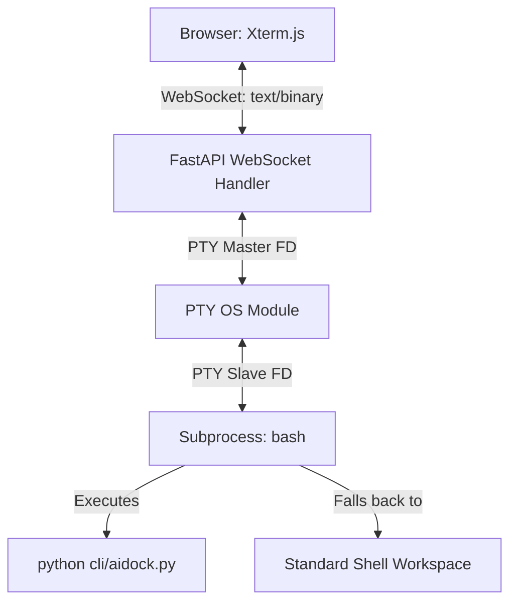

# Architectural Design - AIDock Integrated UI Terminal & CLI Harness

This document outlines the architecture, data flow, and components for the interactive terminal inside the AIDock platform.

---

## 1. High-Level Architecture

The system uses a WebSocket-based pseudo-terminal (PTY) model connecting the browser front-end directly to a containerized terminal instance on the FastAPI backend:

---

## 2. Component Design

### 2.1 Frontend (Xterm.js)
- **Terminal Terminal**: A React component rendering `
`.
- **Addons**:
  - `FitAddon`: Dynamically adjusts row and column counts when window dimensions change.
- **WebSocket Protocol**: Sends character keystrokes directly to the WebSocket and displays returned output streams on screen.

### 2.2 Backend (FastAPI WebSocket Server)
- **Endpoint**: `/ws/terminal?session_id=<session_id>`
- **PTY Pair**:
  - `pty.openpty()` returns a master file descriptor (`master_fd`) and a slave file descriptor (`slave_fd`).
- **Async Spawner**: Spawns `bash` running `python3 /app/cli/aidock.py; exec bash` connected to the `slave_fd` as stdin, stdout, and stderr.
- **Bidirectional Pipes**:
  - `read_from_pty`: Runs non-blocking reads on `master_fd` and sends binary chunks to the WebSocket.
  - `write_to_pty`: Receives inputs from WebSocket and writes bytes directly to `master_fd`.

### 2.3 Command Line Interface (CLI Developer Harness)
- **Container Flag**: Evaluates environment variables to conditionally block compose/host instructions.
- **Agent Chat Client**: Integrates with the backend REST endpoints to execute prompts, render responses as formatted Markdown, and coordinate tool execution.

---

## 3. Communication Protocols

### 3.1 Connection Handshake
1. Client connects to `ws://localhost:8080/ws/terminal?session_id=session_12345`.
2. Backend creates `pty` descriptors, updates the workspace context, and executes the default startup script.

### 3.2 Keypress Events
- Client `xterm.onData(data => socket.send(data))`.
- Backend receives data, writes it to `master_fd`, and the OS propagates it to the running shell process.

### 3.3 Subprocess Output
- Backend reads from `master_fd`, sends bytes over WebSocket.
- Client `xterm.write(data)`.
