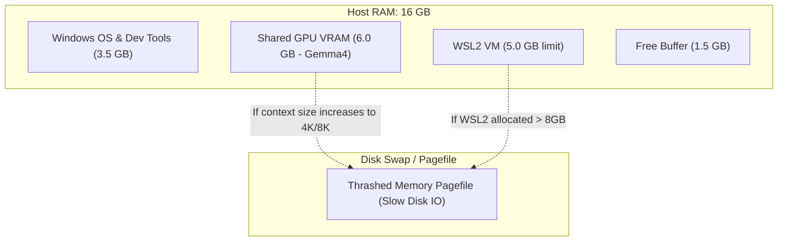

# Hardware Performance & Memory Boundary Report

This report analyzes the physical memory boundary ("The Wall") encountered when running 7.5B+ parameter LLMs (like `Gemma4:E4B`) with larger context windows on machines relying on **Intel Integrated Graphics** and **16 GB of physical RAM**.

---

## 1. Executive Summary

When running local LLMs, system performance is bound by **memory capacity** and **memory bandwidth**. On systems with integrated graphics:
* There is no dedicated VRAM; the GPU shares host system memory (DDR4/DDR5).
* Memory bandwidth is limited to **40–80 GB/s** (system RAM speeds), compared to **400–900 GB/s** on dedicated GPUs (GDDR6).
* Allocating a larger context window (e.g., 4K or 8K) balloons the Key-Value (KV) cache memory requirement.
* Under a 16 GB physical memory ceiling, running a 7.5B model with high context causes the total memory demand to exceed physical RAM, triggering Windows pagefile swapping and reducing performance to near-zero.

---

## 2. Memory Footprint Analysis

The table below breaks down memory consumption at different context sizes when running a 7.5B quantized model (`Gemma4:E4B`) on a 16 GB host.

| Component | 2,048 Context (2K) | 4,096 Context (4K) | 8,192 Context (8K) | Notes / Details |
| :--- | :---: | :---: | :---: | :--- |
| **Model Weights (Q4_K_M)** | 7.52 GB | 7.52 GB | 7.52 GB | Static footprint regardless of context |
| **KV Cache** | ~0.50 GB | ~1.00 GB | ~2.00 GB | Stores token history; scales linearly |
| **GPU Shared Overhead** | ~1.00 GB | ~1.20 GB | ~1.50 GB | DirectML / DXG driver memory overhead |
| **WSL2 Runtime VM** | ~4.00 GB | ~4.00 GB | ~4.00 GB | Postgres, Nginx, FastAPI, Docker daemon |
| **Windows Host OS + Apps** | ~3.50 GB | ~3.50 GB | ~3.50 GB | OS overhead, Chrome, IDE, Task Manager |
| **Total Memory Needed** | **16.52 GB** | **17.22 GB** | **18.52 GB** | **Required physical memory** |
| **Physical RAM Available**| 16.00 GB | 16.00 GB | 16.00 GB | Hard physical ceiling |
| **Memory Deficit (Swap)** | **0.52 GB** | **1.22 GB** | **2.52 GB** | **Forces pagefile swapping** |

---

## 3. The Memory Allocation Conflict

The diagram below illustrates how allocating too much memory to WSL2 starves the Host GPU Shared Memory, causing pagefile thrashing.

> [!WARNING]
> **The Disk Thrashing Wall**: When the memory deficit forces Windows to move pages of the active model weights or KV cache into the disk pagefile (`pagefile.sys`), token generation rates drop from a typical 4–8 tokens/sec down to **`< 0.1 tokens/sec`**, rendering the application unresponsive and timing out the network proxy.

---

## 4. Recommended Hardware Specifications

To run a developer environment with local LLMs at practical context sizes (4K to 8K), we recommend the following target hardware configurations:

### Option A: High-Capacity RAM (For Integrated GPUs)
If stuck on integrated graphics (e.g., Intel Iris Xe / Intel Arc / AMD Radeon), upgrading system RAM is the most cost-effective solution:
* **Minimum System RAM**: **32 GB** (allows 12 GB for WSL2, 12 GB for Shared GPU, 8 GB for Host OS).
* **Recommended RAM Speed**: Dual-channel **DDR5 (5600+ MT/s)** or **LPDDR5X**. High memory bandwidth directly dictates token generation speed.

### Option B: Dedicated GPU (Best Performance)
A dedicated GPU handles the tensor calculations and houses the weights/KV cache entirely in high-speed, dedicated VRAM:
* **Minimum GPU**: NVIDIA GeForce RTX 4060 / 4070 Laptop GPU with **8 GB VRAM**.
* **Recommended GPU**: NVIDIA GeForce RTX 4080 / 4090 with **12 GB or 16 GB VRAM**.
* *Note: Dedicated VRAM operates at bandwidths > 500 GB/s, making inference 10x to 15x faster than integrated graphics.*

---

## 5. Software-Level Workarounds

If upgrading hardware is not an option, you can bypass this memory ceiling using one of these strategies:

1. **Downsize the Model**:
   * Switch the active profile to a smaller model footprint. For example, Qwen-1.5B or Llama-3.2-3B models require only ~1.5–2.5 GB of weights, leaving ample memory for high-context windows (8K+).
2. **Offload to a Cloud Provider**:
   * Modify [`main.py`](file:///c:/AppDev/My_Linkdin/projects/iarxii/AIDock/backend/main.py) to route LLM requests to an external API (e.g., OpenAI, Groq, or OpenRouter) instead of the local Docker Model Runner. This removes the local GPU/RAM footprint entirely.
3. **Smart Context Truncation**:
   * Implement a rolling window in the backend agent state to drop older message history, keeping the active context size below the 2048 token boundary.
