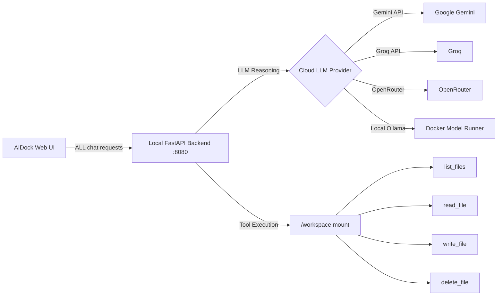

# Hybrid Cloud-Local Architecture for AIDock

## Problem Statement

When AIDock is in **Cloud Mode**, chat messages are routed directly to the remote AICodex Cloud Run server (`/api/spaces/{slug}/codegen`). That server runs on Google Cloud and has **zero access** to the local Docker volume mount (`/workspace`). As a result, the cloud LLM correctly responds that it cannot scan or interact with local files.

Meanwhile, the **Local Ollama Mode** routes through the local FastAPI backend which has full filesystem access — but the user's hardware cannot run LLM inference locally at acceptable quality/speed.

The user needs: **Cloud-grade LLM reasoning + Local filesystem tool execution.**

## Proposed Solution: "Always-Local Orchestrator" Pattern

> [!IMPORTANT]
> The core idea: **Always route chat through the local backend**, even in cloud mode. The local backend uses a **remote LLM provider** (Gemini, Groq, OpenRouter) for reasoning, but executes filesystem tools **locally** on the Docker volume mount. This is architecturally identical to how the VSCode extension works — but without WebSockets.

### Architecture Diagram



**Key insight**: The local backend becomes the **orchestrator** that delegates **thinking** to the cloud but keeps **doing** local.

---

## Proposed Changes

### Backend Agent Layer

#### [NEW] `backend/agent/llm_factory.py`

A multi-provider LLM factory ported from the proven AICodex `get_llm()` pattern in [models.py](file:///c:/AppDev/My_Linkdin/projects/iarxii/AI_Codex/backend/agent/models.py). Supports:

| Provider | LangChain Class | Base URL |
|:---|:---|:---|
| `local` (default) | `ChatOllama` | `model-runner.docker.internal` |
| `gemini` | `ChatGoogleGenerativeAI` | Google API |
| `groq` | `ChatOpenAI` | `api.groq.com/openai/v1` |
| `openrouter` | `ChatOpenAI` | `openrouter.ai/api/v1` |

#### [MODIFY] [state.py](file:///c:/AppDev/My_Linkdin/projects/iarxii/AIDock/backend/agent/state.py)

Add optional fields to `AgentState` to carry cloud provider credentials through the graph:
- `provider: str` — e.g. `"gemini"`, `"groq"`, `"local"`
- `api_key: str` — the user's API key for the selected cloud provider

#### [MODIFY] [nodes.py](file:///c:/AppDev/My_Linkdin/projects/iarxii/AIDock/backend/agent/nodes.py)

Update `reason_node` to resolve the LLM via the new `llm_factory.get_llm()` instead of hardcoded `ChatOllama`. The provider and api_key come from `state["provider"]` and `state["api_key"]`. Tool binding and execution remain unchanged.

---

### Backend API Layer

#### [MODIFY] [main.py](file:///c:/AppDev/My_Linkdin/projects/iarxii/AIDock/backend/main.py)

Extend `ChatRequest` to accept cloud provider credentials:
```python
class ChatRequest(BaseModel):
    message: str
    session_id: str
    model_slug: Optional[str] = None
    provider: Optional[str] = None      # NEW
    api_key: Optional[str] = None        # NEW
```

Pass these through to the agent graph's initial state so `reason_node` can use them.

#### [MODIFY] [requirements.txt](file:///c:/AppDev/My_Linkdin/projects/iarxii/AIDock/backend/requirements.txt)

Add two new dependencies:
```
langchain-openai>=0.0.5
langchain-google-genai>=1.0.0
```

---

### Frontend (Client)

#### [MODIFY] [App.tsx](file:///c:/AppDev/My_Linkdin/projects/iarxii/AIDock/client/src/App.tsx)

The critical change: **In cloud mode, `chat` requests are no longer sent to the remote AICodex Cloud endpoint.** Instead, they are sent to the **local backend** (`/api/chat`) with the cloud credentials attached:

1. Update `getBackendUrl('chat')` to **always** resolve to the local backend URL (`/api/chat`), removing the cloud codegen redirect.
2. Update `handleSend` to include `provider` and `api_key` (from the user's cloud settings) in the request body when cloud mode is active.
3. The cloud connection settings (login, model picker, space selector) remain for **session management** (title fetch, history sync) — only the chat inference routing changes.

> [!WARNING]
> This means chat requests will no longer hit the AICodex Cloud codegen endpoint. The cloud connection is retained only for session metadata, conversation history, and model discovery. All actual LLM inference goes through the local backend, which proxies to the cloud LLM provider APIs directly.

---

## Open Questions

> [!IMPORTANT]
> **API Key Management**: Currently the user logs into AICodex Cloud with username/password and receives a JWT. But the new architecture needs **raw LLM provider API keys** (Gemini API Key, Groq API Key, etc.) to call those providers directly from the local backend. Two options:
> 
> **Option A**: Add a settings panel in AIDock's UI where the user enters their own Gemini/Groq/OpenRouter API keys directly (stored in localStorage). These are passed to the local backend per-request.
> 
> **Option B**: The local backend uses the AICodex Cloud JWT to fetch the user's stored API keys from the cloud profile endpoint (`/api/auth/profile`), extracting them from `settings_json.api_keys`. This is more seamless but adds a cloud dependency for key retrieval.
>
> **Recommendation**: Option A is simpler, faster, and works fully offline. Option B is more seamless for users who have already stored keys in their AICodex Cloud profile. We could support both — try Option B first, fall back to Option A.

---

## Verification Plan

### Automated Tests
1. `npm run build` — verify frontend compiles without TypeScript errors
2. `.\aidock.bat reload --be` then `.\aidock.bat reload --fe` — verify backend builds and starts
3. Test with a direct `curl` to the local backend:
   ```bash
   curl -X POST http://localhost:8080/chat \
     -H "Content-Type: application/json" \
     -d '{"message": "Scan all workspace files", "session_id": "test_hybrid", "provider": "gemini", "api_key": "YOUR_GEMINI_KEY"}'
   ```

### Manual Verification
1. Switch AIDock UI to Cloud Mode
2. Send "Scan all workspace files and summarize their contents"
3. Verify the agent:
   - Uses the cloud LLM for reasoning (check backend logs for provider info)
   - Executes `list_files` tool locally (check backend logs for tool execution)
   - Returns actual file listing from `/workspace/{session_id}`
